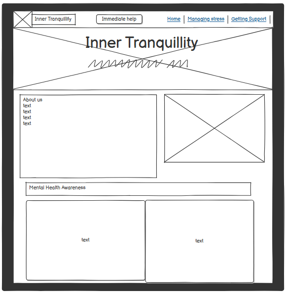

# Inner Tranquillity
Inner Tranquillity is a mental health awareness platform, designed to help the user when in need, and educate those who would like more information if they want to educate themselves or want information for how to help their friend/family/partner.

<a href="https://af-5446.github.io/Inner-Tranquillity/" target="_blank">Live project</a>

## Contents
* [User Experience](#user-experience-ux)
    * [User Stories](#user-stories)

* [Design](#design)
    * [Colour Scheme](#colour-scheme)
    * [Typography](#typograhy)
    * [Imagery](#imagery)
    * [Wireframes](#wireframes)

* [Features](#features)
    * [General Features](#general-features)
    * [Future Implementation](#future-implementation)

* [Technologies Used](#technologies-and-languages-used)
    * [Languages Used](#languages-used)
    * [Frameworks, library and programs](#frameworks-library-programs)

* [Deployment](#deployment)
    * [Deployment](#deploy)

* [Testing](#testing)

* [Credits](#credits)
    * [Code Used](#code-used)
    * [Content](#content)
    * [Media](#media)
    * [Acknowledgments](#acknowledgments)

---

## User Experience (UX)

### User Stories
As someone who struggles with mental health, having a place to find additional resources is a major help when I am feeling overwhelmed.

As a friend of someone who lives with mental health issues, I want to easil nagivate to resources which means I can help my friend in a time of need.

As someone with a challenging job, being able to remind myself about stress navigation for myself and colleagues is a huge help to take time out from work and deadlines.

### User Goals
[x] A user seeks accessible, beginner friendly information on mental health
[x] Section on how to recognise common issues (with mental health)
[x] Section on how to manage stress
[x] Presented in a supportive and organised layout

### Site Owner Goals
[x] Create a welcoming webpage that provides mental health information using a clean and suppoertive design
[x] A focus on using HTML and CSS with Bootstrap to create a calming and well organised user experience.

### Potential Features
[-] Hero section with Positive messaging: A Bootstrap Jumbotron with an encouraging message about mental health  
- This first Criteria was not exactly possible to meet with the use of a jumbotron, as Bootstrap had updated to v5.3, and taken the jumbotron out of use due to other ways the look can be acheived. 

[x] Using calming colour scheme &  
[x] Simple background image

## Design

### Colour Scheme
Colour selection plays a key role in any design process However, knowing this nature of this project, the needs of the user had a greater role, as it may impact their well-being.

Art work also played a role, as my goal was to make the user feel calmed and welcomed when the page was first accessed.

with plenty of research and discussions the use of [WebAIM](https://webaim.org/resources/contrastchecker/) and [image colour picker](https://imagecolorpicker.com/) I was able to find soft colours which I feel best represented mental health.

### Main Palette
- blue: #51c7eb (cards)
- light green: #c1ee9a (buttons)
- grey: #232b2b (text)
- dark green: #5cba64 (button hover)
- light blue: #abdbe3 (background)

<a href="#inner-tranquillity">Back To Top</a>

## Typography

Like colour, the fonts took some consideration and was also discussed with the best option of use. These were implemented via [Google Fonts](https://fonts.google.com). The fonts were imported using a direct code within the style.css file.

[Inter](https://fonts.google.com/specimen/Inter?preview.text=Inner%20Tranquillity) was the font decided on, at "light 300" and "light 300 italic" strength.

<a href="#inner-tranquillity">Back To Top</a>

### Wireframes

[Balsamiq](https://balsamiq.com/) helped to create basic wireframes which laid out basic features and guidance for layout.

**Desktop Wireframe**
can be seen in docs file if not loading on the screen [here](docs/wireframe%20desktop%20top.png)

**Tablet Wireframe**

**Mobile Wireframe**

<a href="#inner-tranquillity">Back To Top</a>

## Imagery
To represent the webpage name, and needing to meet criteria, pastel colours had the most potential, this was also represented in the [Main Palette](#main-palette) with the use of [Pixabay](https://pixabay.com/) and [Pexels](https://www.pexels.com/) images were obtained which best represent the style of the page.
- Promote Inclusivity
- Adhere to colour research
- Appealing to target audience

The main image seen when the webpage is opened, represented the way I wanted to potray the website, [seen here](assets/images/man-looking-at-mountains.webp). 

<a href="#inner-tranquillity">Back To Top</a>

## Features
### General Features
Keeping the fulfilment criteria in mind, the page consists of various sectioned information, some with links to different websites/ further resources.

### Future Implementation
For the future, I would explore more options of design implementation, as I feel it would make the page flow more evenly. Adding in the use of more cards or ways to break up information, so it doesnt feel as overwhelming to the user.

<a href="#inner-tranquillity">Back To Top</a>

## Technologies used
### Technoliges and languages used

## FrameWorks Library and Programs

<a href="#inner-tranquillity">Back To Top</a>

## Deployment
This [Github](https://github.com) project was created with the code institute template in mind. After some issues with editing, it was most ideal to create a separate project to implement a clean usable README.md file.

Setup a repo using this method and template:
1. Login to your GitHub profile.
2. Navigate to the Code Institute Full Template
3. Click the dropdown for 'Use this template' and select "Create a new repository"
4. Generate the necessary name and description for your repo and click 'Create repository from template'
5. Navigate to the new repo and click the green 'Open' button with the Gitpod logo 
**IMPORTANT - This button should only be clicked once to generate the new IDE workspace**
6. You can now work on your repository within the Code Institute Gitpod IDE workspace

Once the project repo is created, an early deployment for the live project should performed. 
This allows for early and continuous testing using a variety of devices, as well as the Dev Tools available within browsers.

Additional information on the deployment process can be found on the official [GitHub Docs](https://docs.github.com/en/pages/quickstart)

<a href="#inner-tranquillity">Back To Top</a>

## Testing
Testing and validation os the website was carried out throughout the course of the project.

This included regular debugging and testing using the Dev Tools as ptovided within Chrome Browser.

[Lighthouse](https://developer.chrome.com/docs/lighthouse/overview) 

Lighthouse had persistent problems for me, no matter what changes I made, especially with images despite being (mostly all) webp format.

### Bugs

whilst using lighthouse, it gave me a good indication with how element were affecting my code. I was able to make a good amount of changes which increased it. When I moved onto including a carousel of images with description, it plummeted the lighthouse score to mid 30's. As I was nearing the deadline, I had to include another stand in of cards, which has also bugged out when trying to make them properly aligned.

"Recognising common issues" the cards for this section wont align, despite multiple media queiry attempts.

"Resource" col-md wont fit to page when md-4,  only allows md-6 but only stacks after that.

As well as lighthouse, HTML and CSS validator was used, but unable to provide an image. There was a persistent "error" on my html which was because I had wrapped list items in a "p" element by accident.

<a href="#inner-tranquillity">Back To Top</a>

## Credits
### Code Institute
Project and primary learning supplied by [Code Institute](https://codeinstitute.net/ie/) 
Supplemental learning resources directly used / referenced within the project:

- [Bootstrap Docs](https://getbootstrap.com/docs/5.3)
- [Gemini](https://gemini.google.com) as a learning tool, no code was directly used
- [Cloudinary](https://cloudinary.com/tools/image-to-webp to convert images from jpg to webp)
- [Photo by Mizuno K:](https://www.pexels.com/photo/couple-sitting-on-bench-with-takeout-12898943/) 
    profile: (https://www.pexels.com/@mizunokozuki/)
- [Photo by Chirayu Vyas: ](https://www.pexels.com/photo/woman-sitting-on-bench-in-forest-and-exercising-yoga-26382826/)
- [Photo by Diliara Garifullina: ](https://www.pexels.com/photo/a-person-pouring-milk-into-a-bowl-with-cereal-and-fruit-26890887/)
- [Photo by Brett Sayles](https://www.pexels.com/@brett-sayles/)
- [Photo of yoga by the lake by Frances Locke](https://pixabay.com/users/thefranceslocke-2099470/)
- [Photo of men overlooking lake and mountains by User: u_9s459qvxh4](https://pixabay.com/users/u_9s459qvxh4-45313559/)

### Content Research
Due to the nature of the project, I was taken to many websites for information, aided with the use of AI to compile the information.

### Acknowledgment
- Kirsten, Annabel and Louise for providing feedback on the website look
- Geraldine, Annabel, Kirsten for providing options for discussions on colours/ images. Kirsten for providing further avenues to discuss mental health needs.

<a href="#inner-tranquillity">Back To Top</a>
